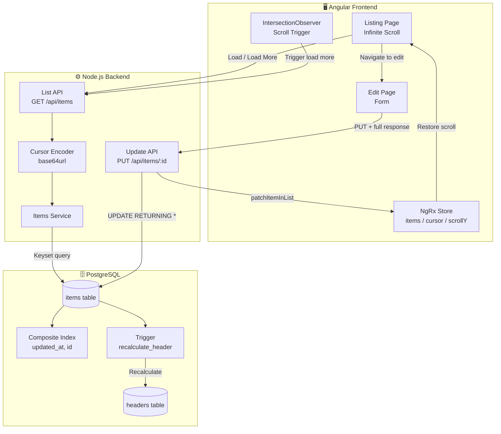
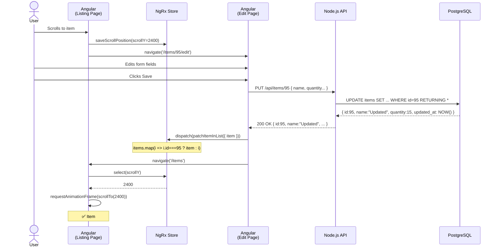
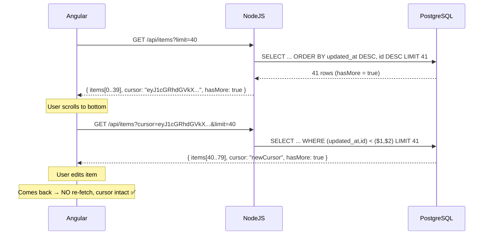
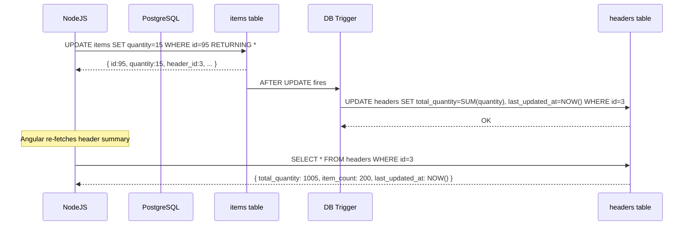
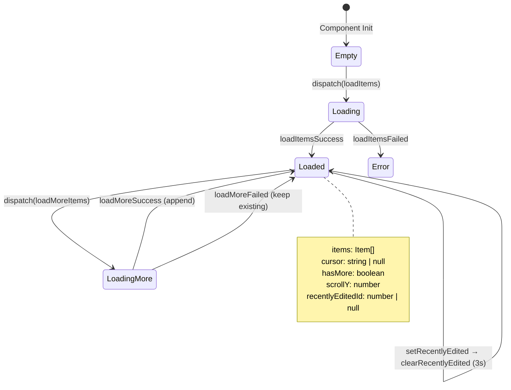
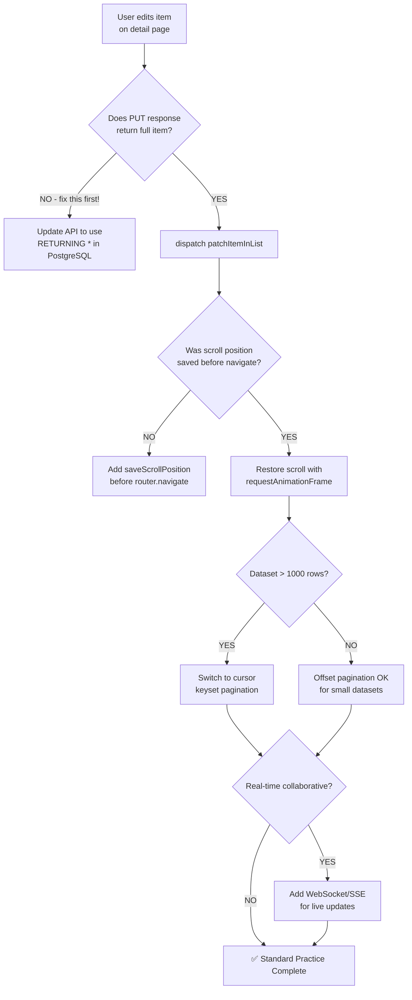

# 06 — Architecture Diagrams

## Diagram 1: Full System Architecture

---

## Diagram 2: Edit → Back Flow (Sequence)

---

## Diagram 3: Cursor Pagination Flow

---

## Diagram 4: Header Table Sync

---

## Diagram 5: NgRx State Machine

---

## Diagram 6: Strategy Selection Flowchart

